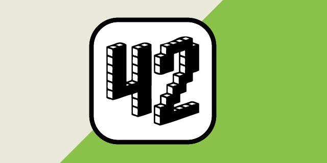

Hi I'm Mathew or GeekMasher, a [Principal Field Security Specialist at GitHub](https://github.com/) and [Founder of 42ByteLabs](https://42bytelabs.com).

- 🔭 I’m currently working on securing the worlds software
- 👯 I’m looking to collaborate on security projects
- 💬 Ask me about security anytime
- ⚡ Fun fact: I love to find and fix bugs in software!

### Public

<table>
    <tr>
        <td>
            
        </td>
        <td>
            
        </td>
    </tr>
    <tr>
        <td>
            
        </td>
        <td>
            
        </td>
    </tr>
    <tr>
        <td>
            
        </td>
        <td>
            
        </td>
    </tr>
</table>

<!-- PROJECTS -->
### Current Projects

| Project (languages) | Stars / Activity |
| :------------------ | :--------------- |
| [SecuriTree.nvim](https://github.com/GeekMasher/securitree.nvim) (Lua)|  -  |
| [Quibble](https://github.com/GeekMasher/quibble) (Rust)|  -  |
| [Gungnir](https://github.com/GeekMasher/gungnir) (Python)|  -  |
| [ghastoolkit](https://github.com/GeekMasher/ghastoolkit) (Python)|  -  |
| [CodeQL Queries](https://github.com/GeekMasher/security-codeql) (CodeQL)|  -  |
| [ghactions](https://github.com/GeekMasher/ghactions) (Rust)|  -  |

### Security Research

| Project (languages) | Stars / Activity |
| :------------------ | :--------------- |
| [rust-sqlx-research](https://github.com/GeekMasher/rust-sqlx-research) (Rust)|  -  |

### GitHub Open-Source Projects

| Project (languages) | Stars / Activity |
| :------------------ | :--------------- |
| [advanced-security/policy-as-code](https://github.com/advanced-security/policy-as-code) (Python)|  -  |
| [GeekMasher/advanced-security-compliance](https://github.com/GeekMasher/advanced-security-compliance) (Python)|  -  |
| [advanced-security/secret-scanning-custom-patterns](https://github.com/advanced-security/secret-scanning-custom-patterns) (Regex, Python)|  -  |
| [advanced-security/codeql-queries](https://github.com/advanced-security/codeql-queries) (CodeQL)|  -  |
| [advanced-security/gh-codeql-scan](https://github.com/advanced-security/gh-codeql-scan) (Bash)|  -  |
| [advanced-security/codeql-summarize](https://github.com/advanced-security/codeql-summarize) (Python, CodeQL)|  -  |
| [advanced-security/ghas-reviewer-app](https://github.com/advanced-security/ghas-reviewer-app) (Python)|  -  |
| [advanced-security/brew-dependency-submission-action](https://github.com/advanced-security/brew-dependency-submission-action) (Python)|  -  |
| [advanced-security/cocoapods-dependency-submission-action](https://github.com/advanced-security/cocoapods-dependency-submission-action) (Python)|  -  |
| [GeekMasher/gradle-lock-dependency-submission-action](https://github.com/GeekMasher/gradle-lock-dependency-submission-action) (Python)|  -  |

<!-- PROJECTS END -->

[All / Additional Projects](https://github.com/GeekMasher/GeekMasher/blob/master/projects.md)
